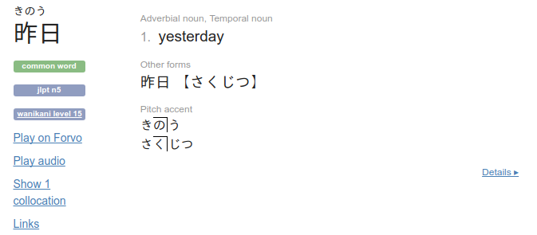
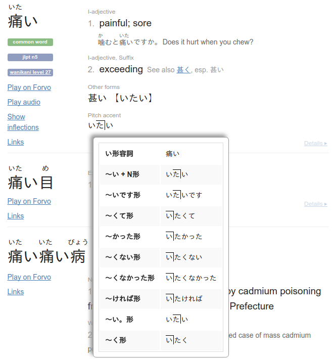

Jisho-OJAD
==========

This Chrome extension adds inline pitch accent notation for Jisho.

The data is queried on the fly from the [OJAD](http://www.gavo.t.u-tokyo.ac.jp/ojad/) database.

Installation
------------

1. On this page, go to "Clone or download" -> "ZIP file" and unzip the downloaded file
2. Browse to chrome://extensions
3. Tick "Developer mode"
4. Click "Load unpacked extension"
5. Pick the unzipped directory
